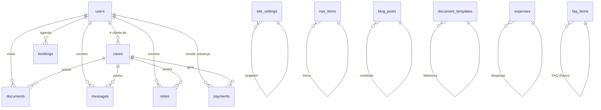

# Modelo de dados

Schema completo em [`supabase/schema.sql`](../../../supabase/schema.sql) e migrations em [`supabase/migrations.sql`](../../../supabase/migrations.sql).

## Diagrama simplificado

## Tabelas principais

| Tabela | Papel | Chave |
|---|---|---|
| `users` | Advogadas (`ADMIN`) e clientes (`CLIENT`) | `email` único |
| `cases` | Casos do escritório | `client_id → users` |
| `bookings` | Consultas agendadas | `email` |
| `documents` | Arquivos anexados a casos | `case_id → cases` |
| `messages` | Chat cliente ⇄ advogada | `case_id`, `author_id` |
| `notes` | Anotações internas | `case_id`, `author_id` |
| `payments` | Honorários | `client_id`, `case_id?` |
| `expenses` | Despesas do escritório | — |
| `leads` | Formulários de contato | — |
| `site_settings` | Textos, foto, contato (singleton `id='default'`) | — |
| `nav_items` | Menu do header | `position` |
| `blog_posts` | Artigos | `slug` único |
| `document_templates` | Modelos de documentos | — |

## Segurança
Row Level Security está habilitado, mas o app **usa a service key** e bypassa RLS. Consultas com a publishable key (não usadas hoje) veriam só o que policy permite. Ver [[ADR-001 - Supabase como banco]].

## IDs
Todos os `id` são `cuid2` gerados em JS (`@paralleldrive/cuid2`). Formato: `abc123...`.
